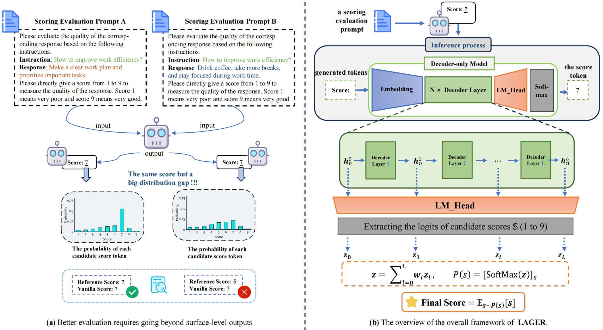

# 🌟 LAGER

Welcome to the official code repository for **[Beyond the Surface: Enhancing LLM-as-a-Judge Alignment with Human via Internal Representations]**! 🚀 This repository contains all the code, resources, and instructions needed to explore our work and reproduce the experimental results from our paper. If you are interested in our work or wish to reproduce our experimental results, please read the following sections carefully.

<p align="center">
  
</p>

---

## 📜 Abstract

**LAGER** is a lightweight and effective framework for improving *LLM-as-a-Judge* alignment with human scores through internal representations. While traditional approaches often rely on prompt engineering or fine-tuning, **LAGER** sidesteps these complexities by aggregating **layer-wise score-token logits** from a frozen LLM backbone.

Motivated by findings that middle-to-upper layers encode judgment-relevant features better than the final layer, LAGER aggregates score-token logits from different layers of the model, applies a softmax to construct a score distribution, and computes the expected value as the final score. This effectively leverages rich evaluative signals across layers and overcomes the limitations of relying solely on the final output layer in traditional methods.

🔍 **Key Highlights**:
- Achieves **up to +7.5%** improvement over baselines on **Flask**, **HelpSteer**, and **BIGGen** benchmarks (Spearman correlation).
- Matches or exceeds **reasoning-based methods** without requiring reasoning traces.
- Shows robust transferability across diverse downstream tasks, including **data selection**, **emotion understanding**, and **knowledge boundary detection**.
---

## 📑 Table of Contents

- [🌟 LAGER](#-lager)
- [📜 Abstract](#-abstract)
- [🛠️ Environment Setup](#environment-setup)
- [🔬 Experiments](#experiments)
- [📝 Citation](#-citation)

---

## 🛠️ Environment Setup

Follow the instructions below to set up the environment.

```bash
# Create a new conda environment
conda create --name lager python=3.10 

# Activate the environment
conda activate lager

# Clone the repository
git clone https://github.com/Laip11/lager.git

# Navigate to the project directory
cd lager

# Install dependencies
pip install -r requirements.txt
```

## 🔬Experiments
> We provide the running scripts for all experiments in the paper in the [scripts](./scripts) directory. In these files, we include code examples for execution, and you can adjust the specific parameters according to your needs.

> You must first run the script `scripts/run_direct.sh` to obtain the results of the corresponding model on the valid_data.


Note: Please make appropriate adjustments based on your local computing resources. Slight variations in the results may occur due to the influence of batch size, which is a normal behavior.

1. **Main experiments**
> Here, we take the evaluation of the Meta-Llama-3.1-8B-Instruct model on Flask as an example.

```bash
# Direct condiiton 
CUDA_VISIBLE_DEVICES=0 python3 lager/get_pointwise_outputs.py \
     --model_name_or_path LLM-Research/Meta-Llama-3.1-8B-Instruct \
     --save_dir results \
     --points 5 \
     --batch_size 4 \
     --max_new_tokens 10 \
     --dtype bfloat16 \
     --input_file data/main/flask.json

## You can modify your parameters in the `scripts/run_direct.sh` script and then run it.
## bash scripts/run_direct.sh

# Reasoning condition
CUDA_VISIBLE_DEVICES=0 python3 lager/get_pointwise_outputs.py \
      --model_name_or_path  LLM-Research/Meta-Llama-3.1-8B-Instruct \
      --save_dir results \
      --points 5 \
      --batch_size 4 \
      --max_new_tokens 256 \
      --with_feedback \
      --dtype bfloat16 \
      --input_file data/main/flask.json

## You can modify your parameters in the `scripts/run_reasoning.sh` script and then run it.
## bash scripts/run_reasoning.sh

```
You can run the `evaluation.py` script to obtain the results after generating the data_res and valid_data_res files corresponding to the model. For example,
```bash
## Evaluate Meta-Llama-3.1-8B-Instruct’s performance on Flask under the “Direct” condition.
python evaluation.py \
  --data_path results/flask/Meta-Llama-3___1-8B-Instruct_logits.json \
  --valid_data_path results/valid/Meta-Llama-3___1-8B-Instruct_logits.json
```
2. **Instruction Data Selection**

Note: Please make sure that your model is consistent with your `valid_data_path`.

In this experiment, you need to assign scores for seven evaluation criteria, specifically including `answer_accuracy`, `logical_consistency`, `relevance`, `fluency_and_clarity` ,`length_appropriateness`, `diversity`, and `instruction_difficulty`. Please make sure to have collected the scores for all evaluation criteria before proceeding with supervised fine-tuning.
```bash
CUDA_VISIBLE_DEVICES=0 python3 lager/sft_data_filtering.py \
      --data_path sft_prompt_7type.jsonl\
      --aspect answer_accuracy \
      --batch_size 16 \
      --model_name_or_path LLM-Research/Meta-Llama-3.1-8B-Instruct

## You can modify your parameters in the `scripts/run_sft_data_filtering.sh` script and then run it.
## bash scripts/run_sft_data_filtering.sh
```

3. **Self Knowledge**

Note: Please make sure that your model is consistent with your `valid_data_path`.
```bash
CUDA_VISIBLE_DEVICES=0 python lager/self-knowledge.py \
    --model LLM-Research/Meta-Llama-3.1-8B-Instruct \
    --valid_data_path results/valid/Meta-Llama-3___1-8B-Instruct_logits.json \
    --in_file data/self-knowledge/prompt_unknow.json

## You can modify your parameters in the `scripts/run_self_knowledge.sh` script and then run it.
## bash scripts/run_self_knowledge.sh
```
4. **Sentiment Understanding**

Note: Please make sure that your model is consistent with your `valid_data_path`.
```bash
CUDA_VISIBLE_DEVICES=0 python lager/sentiment_understanding.py \
        --model_path LLM-Research/Meta-Llama-3.1-8B-Instruct \
        --valid_data_path results/valid/Meta-Llama-3___1-8B-Instruct_logits.json 

## You can modify your parameters in the `scripts/run_sentiment_understanding.sh` script and then run it.
## run scripts/run_sentiment_understanding.sh
```

5. **Ablation Experiment**

- First, obtain the results of InternLM3-8B-Instruct and Mistral-7B-Instruct-V0.3 on Flask under the direct condition.
- Then you need to change the `scores` in the `print_correlations` function of the `lager/evaluation.py` file.
```python
# Original variable
#scores = ['direct_score','e_score','lager_wo','lager_w']

# Modified variable
scores = ['lager_w',
          'prob_weighted_agg_e_score',
          'logits_agg_weighted_max_score',
          'prob_weighted_agg_max_score',
          'lager_wo',
          'prob_agg_e_score',
          'logits_agg_max_score',
          'prob_agg_max_score',
          'e_score',
          'direct_score']
```
- You can obtain the ablation experiment results by following run the `lager/evaluation.py`

## 📝 Citation

If you find our work useful, please consider citing our paper!
```bibtex
@misc{lai2025surfaceenhancingllmasajudgealignment,
      title={Beyond the Surface: Enhancing LLM-as-a-Judge Alignment with Human via Internal Representations}, 
      author={Peng Lai and Jianjie Zheng and Sijie Cheng and Yun Chen and Peng Li and Yang Liu and Guanhua Chen},
      year={2025},
      eprint={2508.03550},
      archivePrefix={arXiv},
      primaryClass={cs.CL},
      url={https://arxiv.org/abs/2508.03550}, 
}
```
